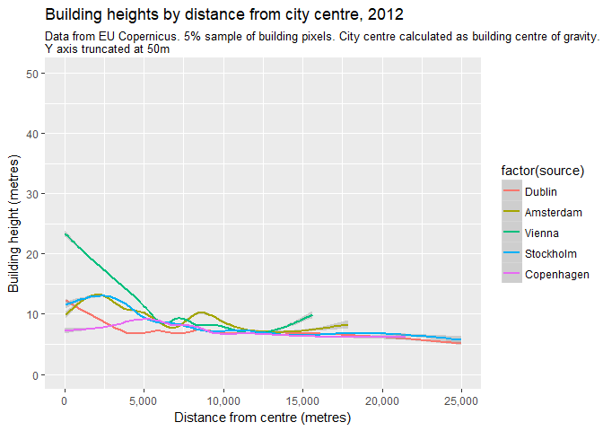

Analysing building heights in EU capitals using Copernicus data
================

The EU's 'earth observation programme' [Copernicus](http://www.copernicus.eu/) recently published some great data on building heights in European capital cities, which you can browse using an excellent webmap interface [here](https://land.copernicus.eu/local/urban-atlas/building-height-2012?tab=mapview) and download (after registration) city by city [here](https://land.copernicus.eu/local/urban-atlas/building-height-2012?tab=download). In this note I show how to use R to carry out some basic analysis of average building heights in each city, and to show how building heights vary with distance from city centres.

The first step is to load several packages that we'll be using.

``` r
library(raster) # for importing and analysing raster data
library(rgdal) # spatial operations
library(SDMTools) # calculates centre of gravity of a raster
library(tidyverse) # data analysis and plotting
library(gdata) # for 'combine' function
library(knitr) #  for tables
```

The Copernicus data is in raster rather than vector format, meaning that buildings are represented by one or more pixels rather than polygons. with an average pixel size of 10 metres. There are a **lot** of pixels in these datasets - 33.6 million in London alone, for example - which poses some challenges for analysis.

It also means that you have to download the (zipped) data for each city separately. There are 31 cities included so I haven't covered all of them in the analysis, just two selected groups of larger and smaller ones.

Because you have to download the datasets manually and because they are too large to process all at once, for the purposes of this code I have assumed that you have downloaded the zipped files and extracted them into a subfolder of your project directory or working directory called 'data'.

We'll be building a function to import and process this data in one go, but to explain the steps let's go through them one by one for an example city, which in this case will be Dublin.

First, we read the data using the `raster` function from the package of the same name.

``` r
Dublin <- raster("data/IE001L1_DUBLIN_UA2012_DHM/IE001L1_DUBLIN_UA2012_DHM.tif")
```

We can then plot this to get an idea of the area covered.

``` r
plot(Dublin)
```


I'm interested in understanding how building heights change as you get further out from the city centre - but to do that we need to locate the city centre. We could do this manually, but since we'll be dealing with several other cities later I prefer to do it automatically by finding the 'centre of gravity' of the raster dataset, taking into account te height of each pixel. To do this we use the `COGravity` function from the `SDMTools` package.

``` r
city.centre <- COGravity(Dublin)
cent.matrix <- t(data.matrix(unname(c(city.centre[[1]],city.centre[[3]])))) # extract centre of gravity coordinates
```

Next, calculate the distance from each point in the original building heights dataset to the city centre that we've calculated.

``` r
distplot <- distanceFromPoints(Dublin, cent.matrix) # calculate distance from 'city centre'
```

In order to combine this with our original raster dataset we need to 'stack' the two of them together, again using the `raster` package.

``` r
stack <- stack(Dublin, distplot) # stack heights and distance rasters
```

While it is possible to run different kinds of calculations on raster layers, I found it much easier to convert the raster stack into a dataframe.

``` r
stackdf <- as.data.frame(stack) # convert to data frame
```

This dataframe has two columns, one for building heights (in metres) and one for distance from the city centre (also in metres). Let's rename them accordingly.

``` r
names(stackdf) <- c("height","distance")
```

Now we have our dataset in the form we want it we can do some analysis. First, let's calculate the average height of all the building pixels. To do so we filter out any pixels where the height is given as either 'N/A' (because it's undeveloped land) or '0' because it's developed land with zero height.

``` r
average <- stackdf %>%
  filter(!is.na(height) & height > 0) %>% 
  summarise(average_height=mean(height))
average
```

    ##   average_height
    ## 1        7.22802

So the mean average height of buildings in Dublin is 7.23m.

We can also plot building height by distance from the city centre. Now, I found this was extremely slow when working with the whole dataset, so in the examples that follow I take a 5% random sample of pixels from each raster dataset. Because most buildings consist of multiple pixels this seems to make little difference to the overall result.

``` r
p1 <- sample_frac(stackdf, size=0.05) %>%
  filter(height > 0 & !is.na(height)) %>%
  ggplot(mapping=aes(x = distance, y = height)) +
  geom_point(alpha=1/100) +
  geom_smooth() +
  ylim(c(0,30)) +
  scale_x_continuous(limits = c(0,25000), labels = scales::comma)+
  labs(title = "Dublin building heights by distance from city centre, 2012",
       subtitle = "Data from EU Copernicus. 5% sample of building pixels. City centre calculated as building centre of gravity.\nY axis truncated at 30m",
       x = "Distance from centre (metres)",
       y = "Building height (metres)")
p1
```

    ## `geom_smooth()` using method = 'gam'


Now that we've walked through these steps for one city, we can string the data importation an processing steps together to create a function that can be used on any city. In the code below I call this function 'heightsdf' to stand for 'heights data frame', which is the end product we are looking for.

``` r
# Function to turn heights raster into a dataframe of heights and distance to city centre
heightsdf <- function(x){
  city <- raster(x) # import raster
  city.centre <- COGravity(city) # calculate centre of gravity
  cent.matrix <- t(data.matrix(unname(c(city.centre[[1]],city.centre[[3]])))) # extract centre of gravity coordinates
  distplot <- distanceFromPoints(city, cent.matrix) # calculate distance from 'city centre'
  stack <- stack(city, distplot) # stack heights and distance rasters
  stackdf <- as.data.frame(stack) # convert to data frame
  names(stackdf) <- c("height","distance") # rename data frame columns
  return(stackdf) # output data frame
}
```

To use this function we just apply it to the file path of each raster we want to import. So for Vienna it would be:

``` r
Vienna <- heightsdf("data/AT001L2_WIEN_UA2012_DHM/AT001L2_WIEN_UA2012_DHM.tif")
```

And for Dublin and a few other cities it would be:

``` r
Dublin <- heightsdf("data/IE001L1_DUBLIN_UA2012_DHM\\IE001L1_DUBLIN_UA2012_DHM.tif")
Amsterdam <- heightsdf("data/NL002L2_AMSTERDAM_UA2012_DHM\\NL002L2_AMSTERDAM_UA2012_DHM.tif")
Stockholm <- heightsdf("data/SE001L1_STOCKHOLM_UA2012_DHM\\SE001L1_STOCKHOLM_UA2012_DHM.tif")
Copenhagen <- heightsdf("data\\DK001L2_KOBENHAVN_UA2012_DHM\\DK001L2_KOBENHAVN_UA2012_DHM.tif")
```

Once these have been imported they can be combined into one dataframe, using the `combine` function from the `gdata` package which adds the source object names as a variable.

``` r
combo <- gdata::combine(Dublin, Amsterdam, Vienna, Stockholm, Copenhagen)
```

With this combined dataset we can carry out various kinds of comparative analysis. Let's start by calculating the average height for each city.

``` r
aveheight <- combo %>% 
  filter(!is.na(height) & height > 0) %>% 
  group_by(source) %>%
  summarise(average_height=mean(height))
kable(aveheight, digits=2, caption="Average building height in European cities (m)",
      format="html")
```

<table>
<caption>
Average building height in European cities (m)
</caption>
<thead>
<tr>
<th style="text-align:left;">
source
</th>
<th style="text-align:right;">
average\_height
</th>
</tr>
</thead>
<tbody>
<tr>
<td style="text-align:left;">
Dublin
</td>
<td style="text-align:right;">
7.23
</td>
</tr>
<tr>
<td style="text-align:left;">
Amsterdam
</td>
<td style="text-align:right;">
9.77
</td>
</tr>
<tr>
<td style="text-align:left;">
Vienna
</td>
<td style="text-align:right;">
10.88
</td>
</tr>
<tr>
<td style="text-align:left;">
Stockholm
</td>
<td style="text-align:right;">
8.20
</td>
</tr>
</tbody>
</table>
And we can produce a faceted plot comparing how building heights vary with distance from the calculated city centre. For the purposes of plotting, we again take 5% samples and exclude any zero/NA values. The trend lines here are esimated using the `gam` for `generalised additive model`.

For Amsterdam and (in particular) Copenhagen the calculation of the city centre looks like it might be a bit off as heights actually peak slightly further out.

``` r
facetplot <- sample_frac(combo, size=0.05) %>%
  filter(height > 0 & !is.na(height)) %>%
  ggplot(mapping=aes(x = distance, y = height)) +
  geom_point(aes(colour=factor(source)),alpha=1/100) +
  geom_smooth(aes(colour=factor(source))) +
  ylim(c(0,50)) +
  scale_x_continuous(limits = c(0,25000), labels = scales::comma)+
  labs(title = "Building heights by distance from city centre, 2012",
       subtitle = "Data from EU Copernicus. 5% sample of building pixels. City centre calculated as building centre of gravity.\nY axis truncated at 50m",
       x = "Distance from centre (metres)",
       y = "Building height (metres)") +
  facet_wrap(~source)
facetplot
```

    ## `geom_smooth()` using method = 'gam'


Here's a version of the plot that just compares the trendlines.This shows that the key differences in building heights are within 7.5km of the 'city centre', after which the typical height is around 7m in all five cities.

``` r
comboplot <- sample_frac(combo, size=0.05) %>%
  filter(height > 0 & !is.na(height)) %>%
  ggplot(mapping=aes(x = distance, y = height)) +
  geom_smooth(aes(colour=factor(source))) +
  ylim(c(0,50)) +
  scale_x_continuous(limits = c(0,25000), labels = scales::comma)+
  labs(title = "Building heights by distance from city centre, 2012",
       subtitle = "Data from EU Copernicus. 5% sample of building pixels. City centre calculated as building centre of gravity.\nY axis truncated at 50m",
       x = "Distance from centre (metres)",
       y = "Building height (metres)")
comboplot
```

    ## `geom_smooth()` using method = 'gam'



And here's a column plot of average heights.

``` r
aveheight %>% ggplot(aes(x=reorder(source, average_height), y=average_height)) +
  geom_col(fill="red") +
  labs(title = "Mean building height (metres) in European capitals, 2012",
       subtitle = "Data from EU Copernicus",
       x = "City",
       y = "Mean building height (metres)") +
  theme_minimal() +
  ylim(c(0,12)) +
  geom_text(aes(x=reorder(source, average_height), y=average_height,label = round(average_height,2), vjust=-1))
```


